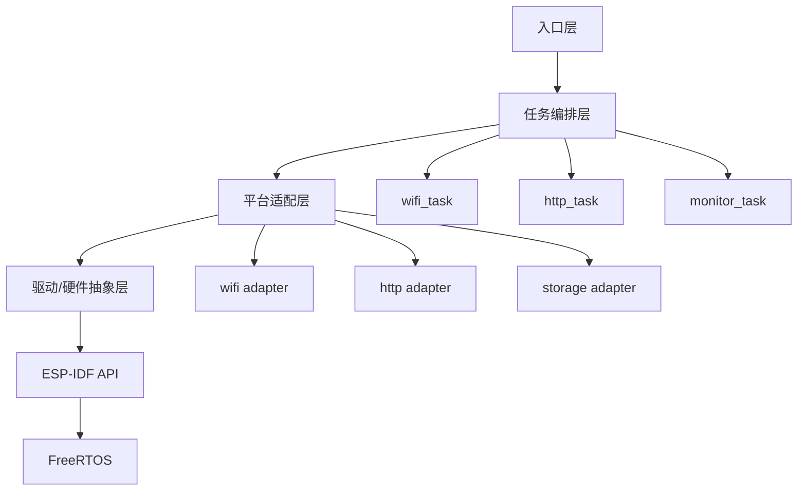

# C 到 C++ 封装与重构方案

## 目标
- 在不改变现有功能与时序的前提下，引入小范围 C++ 封装，提升模块边界清晰度与可维护性。
- 保持 ESP-IDF C API 兼容，避免大规模改动与风险。

## 总体原则
- 以“边界包裹”为主：对现有 C 模块建立薄封装类，不直接重写底层驱动逻辑。
- C 与 C++ 通过 `extern "C"` 互操作，逐步迁移调用点。
- 不引入异常与 RTTI；保持编译选项与资源开销可控。

## 目标架构分层与语言选择
建议分 4 层，自下而上责任明确，并给出语言边界：

1) 驱动/硬件抽象层（C）
- 内容：GPIO、SPI、SDIO、Wi-Fi、NVS、HTTP 底层 API（ESP-IDF C API）。
- 原因：ESP-IDF 与多数 SDK 接口是 C，稳定且资源开销可控。
- 形式：保持为 `.c/.h`，不引入 C++ 依赖。

2) 平台适配层（C）
- 内容：事件与回调桥接、任务创建、队列封装、时间/日志适配。
- 原因：与 FreeRTOS/ESP-IDF 深度耦合，C 更直观可靠。
- 形式：继续提供 `*_service_*` 形式的 C API。

3) 任务编排层（C++）
- 内容：任务创建、同步与调度（如 Wi‑Fi、HTTP、监控任务）。
- 原因：任务编排与同步需要更清晰的结构，C++ 便于组织。
- 形式：保留在 `main/app/`，以 task 形式承载业务逻辑。

4) 入口层（C）
- 内容：`app_main.c` 作为 ESP-IDF 入口。
- 原因：保持与 ESP-IDF 入口约定一致，风险最小。
- 形式：C 入口内部调用 C++ “应用层入口”或单一桥接函数。

## 分层职责与目录映射
突出语义的目录命名示例（更利于理解层级，不强调语言）：

层次结构图（整体架构与调用关系）：



1) 入口层
- 目录/文件：`main/app_main.c`
- 责任：系统启动、最小化胶水逻辑、调用应用层入口
- 语言：C
- 示例：调用 `app_runtime_start()` 或单一 C 桥接函数

2) 任务编排层
- 目录：`main/app/`
- 责任：任务创建、同步与调度（Wi‑Fi/HTTP/监控等）
- 语言：C++
- 示例：`main/app/app_runtime.hpp/.cpp`

3) 平台适配层
- 目录：`main/services/`
- 责任：对 ESP-IDF/FreeRTOS 的 C API 做薄封装，提供稳定 C 接口
- 语言：C
- 示例：`main/services/wifi/wifi.c`、`main/services/http/http_client.c`

4) 驱动/硬件抽象层
- 目录：`main/hal/`
- 责任：板级配置、引脚定义、硬件相关常量与辅助函数
- 语言：C
- 示例：`main/common/board.h`

备注：
- 目录命名以语义为主，语言边界通过文件扩展名体现（`.c`/`.cpp`）。

## 目录结构建议
- `main/app/`：任务编排与调度（C++）。

## 互操作方式
- 在 C++ 文件中包含 C 头文件：

```cpp
extern "C" {
#include "wifi.h"
#include "http_client.h"
}
```

- 在 C 代码中如需调用 C++：
  - 使用 C 接口封装 C++ 对象生命周期（工厂函数模式）。
  - 仅在确有必要时再使用该方式。

## 逐步迁移路线
1) 阶段 1：引入 C++ 架构骨架
- 添加 `main/cpp/` 与 C++ 编译配置。
- 保持 `app_main.c` 现状，新增 C++ 模块但不使用。

2) 阶段 2：C++ 封装与替换调用点
- 在 `app_main.c` 保持 C 入口，内部仅替换为 C++ 调用（通过单一 C 接口桥接）。
- 验证 Wi-Fi 连接与 HTTP 请求逻辑行为不变。

3) 阶段 3：扩展应用层逻辑
- 若需要更复杂编排，新增 `app_runtime.cpp`，集中任务创建与生命周期管理。
- 继续保留 `app_main.c` 作为 ESP-IDF 入口。

## 构建配置改动
- 在 `main/CMakeLists.txt` 中新增 C++ 源文件列表并启用 C++ 编译。
- 确保 `project()` 与 `idf_component_register()` 对 C++ 编译器生效。

## 风险与规避
- 内存占用增加：限制动态分配，优先栈对象。
- 异常/RTTI 开销：显式关闭，避免编译期默认开启。
- 混合编译问题：严格区分 `.c` 与 `.cpp`，并使用 `extern "C"`。

## 验证与测试
- 基础验证：`idf.py build`, `idf.py flash monitor`。
- 功能验证：Wi-Fi 连接成功后发起 HTTP 请求，并确认串口日志输出一致。

## 预期收益
- 更清晰的模块边界与可测试性。
- 更容易加入状态管理、重试策略与日志封装。
- 未来扩展任务编排与服务层时更自然。
